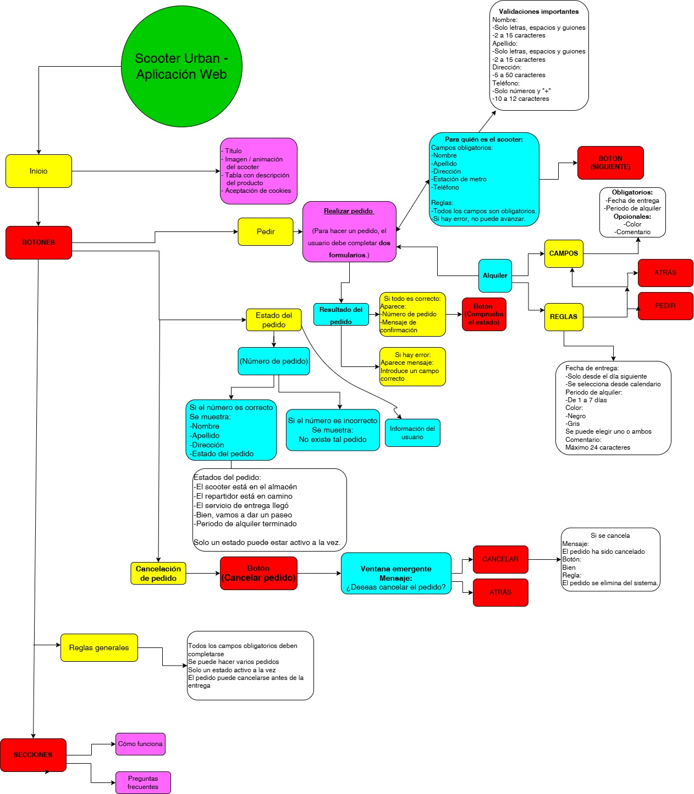
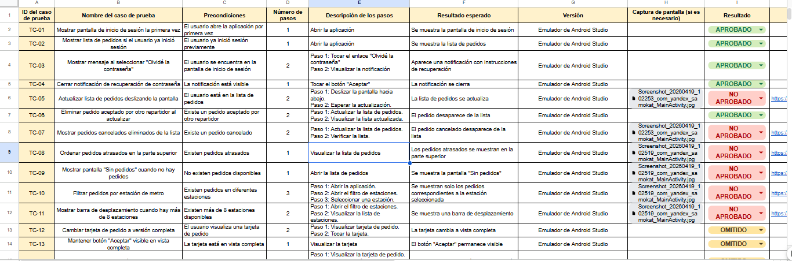
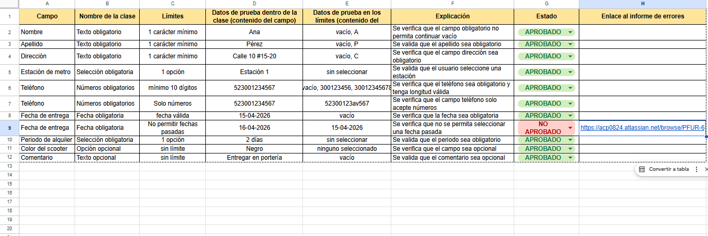
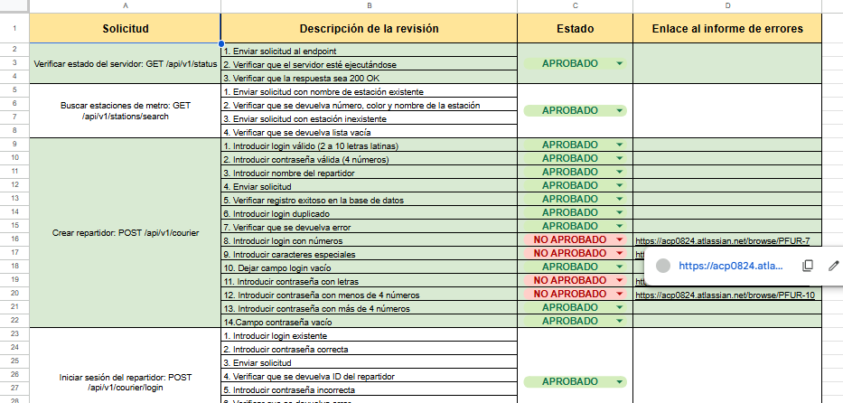
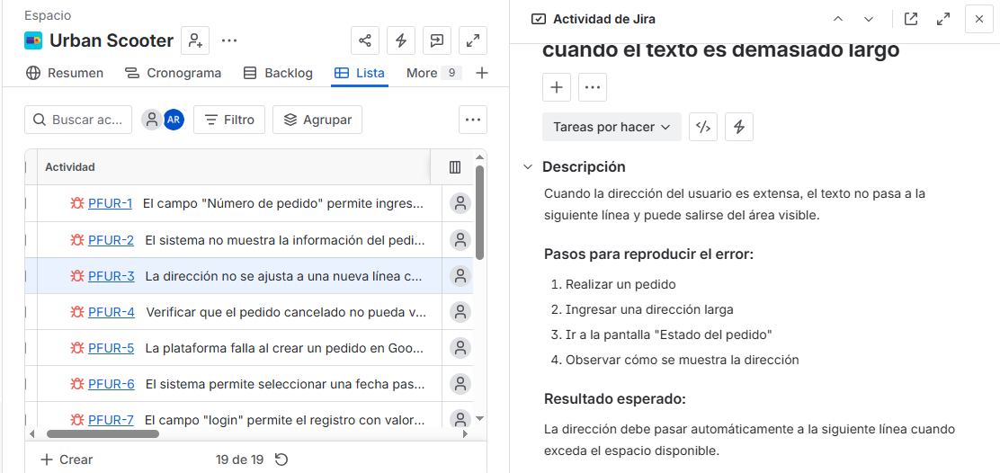
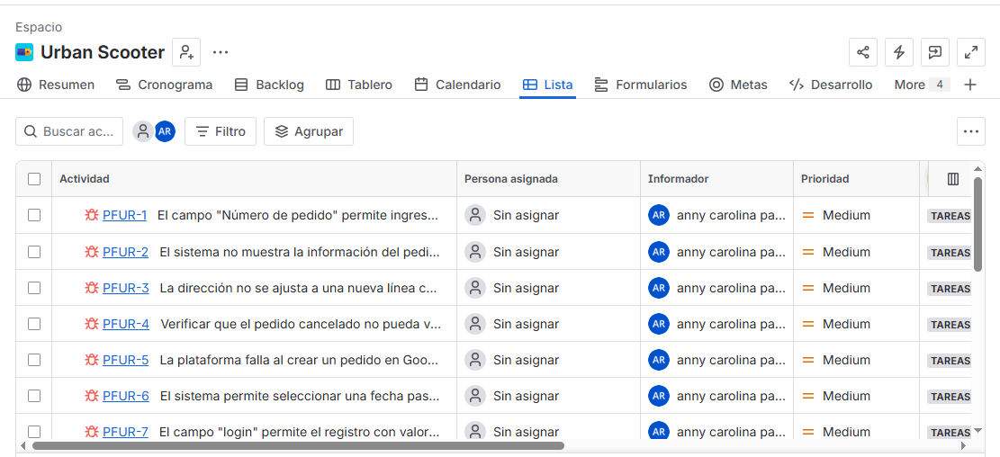

# 🛴 Urban Scooter - Proyecto de Pruebas Manuales

## 📋 Descripción del proyecto

Este proyecto fue desarrollado como parte del Bootcamp de QA Engineering de TripleTen.

El objetivo fue evaluar la calidad de la aplicación **Urban Scooter**, realizando pruebas manuales sobre la versión web y la aplicación móvil. Durante el proyecto se diseñaron y ejecutaron diferentes artefactos de prueba para validar funcionalidades, identificar defectos y documentar evidencias del proceso de aseguramiento de la calidad.

---

# 🎯 Objetivo

Aplicar técnicas de pruebas manuales para verificar el correcto funcionamiento de la aplicación Urban Scooter mediante el diseño y ejecución de pruebas funcionales, elaboración de documentación QA y reporte de defectos.

---

# 👩‍💻 Mi rol en el proyecto

Como QA Engineer participé en las siguientes actividades:

- Análisis de requisitos.
- Diseño de casos de prueba.
- Elaboración de listas de comprobación.
- Validación de datos.
- Ejecución de pruebas funcionales.
- Registro y documentación de defectos en Jira.
- Organización de evidencias de prueba.

---

# 🛠 Herramientas utilizadas

| Herramienta | Uso |
|-------------|-----|
| Jira | Registro y seguimiento de defectos |
| Microsoft Excel | Casos de prueba, checklists, validación de datos y mapa mental |
| Figma | Validación del diseño de la interfaz |
| Google Chrome | Ejecución de pruebas web |
| Android Studio | Validación de la aplicación móvil |

---

# 🧪 Actividades realizadas

Durante este proyecto desarrollé los siguientes entregables:

- ✅ Casos de prueba.
- ✅ Validación de datos.
- ✅ Mapa mental.
- ✅ Lista de comprobación de la API.
- ✅ Lista de comprobación del estado del pedido.
- ✅ Reportes de errores en Jira.

---

# 📂 Estructura del repositorio

```text
Urban-Scooter---Manual-Testing
│
├── documentos
│   └── artefactos-de-prueba-de-patinete-urbano.xlsx
│
├── imagenes
│   ├── mapa-mental-web.jpg
│   ├── casos-de-prueba.png
│   ├── validacion-de-datos.png
│   ├── checklist-api.png
│   ├── checklist-estado-pedido.png
│   ├── reportes-errores.png
│   └── jira-reportes.png
│
├── reportes-errores
│
└── README.md
```

---

# 📸 Evidencias

## 🧠 Mapa mental



---

## ✅ Casos de prueba



---

## 📊 Validación de datos



---

## ✔ Lista de comprobación de la API



---

## ✔ Lista de comprobación del estado del pedido


---

## 🐞 Reportes de errores



---

## 📋 Registro de incidencias en Jira



---

## 📈 Resultados del proyecto

Este proyecto me permitió aplicar el ciclo completo de pruebas manuales sobre una aplicación web y móvil, desde el análisis de los requisitos hasta la documentación de los defectos encontrados. Como resultado, elaboré artefactos de prueba y evidencias que respaldan el proceso de validación, contribuyendo a identificar oportunidades de mejora en la calidad del software.

## 📚 Aprendizajes

Durante el desarrollo de este proyecto fortalecí habilidades como:

- Analizar requisitos para diseñar una estrategia de pruebas efectiva.
- Diseñar casos de prueba, listas de comprobación y validaciones de datos para diferentes escenarios.
- Ejecutar pruebas funcionales en aplicaciones web y móviles.
- Documentar evidencias y registrar defectos de manera clara y estructurada utilizando Jira.
- Organizar la documentación de pruebas para facilitar su seguimiento y mantenimiento.

---

# 👤 Sobre mí

Soy **Anny Carolina Pallares**, QA Engineer con formación en pruebas manuales, pruebas de API y automatización, interesada en contribuir al desarrollo de productos de software confiables mediante una estrategia de pruebas estructurada.

---

# 📫 Contacto

**GitHub**

https://github.com/acp0824-ops

**LinkedIn**

https://www.linkedin.com/in/anny-pallares94
